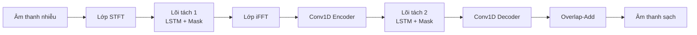
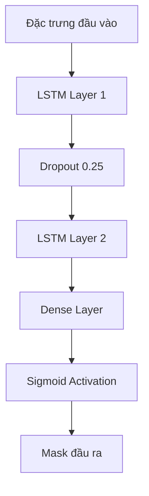
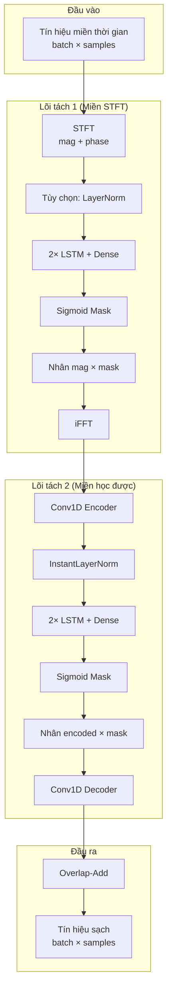
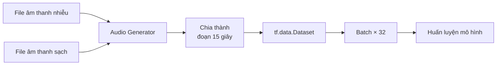
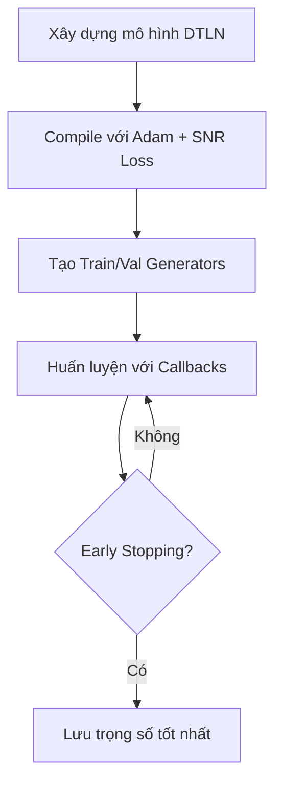

# Kiến Trúc Mô Hình DTLN

**Dual-signal Transformation LSTM Network** - Mạng LSTM biến đổi tín hiệu kép cho khử nhiễu và tăng cường giọng nói thời gian thực.

---

## Tổng Quan

DTLN (Dual-signal Transformation LSTM Network) là mạng neural nhẹ được thiết kế cho tăng cường giọng nói thời gian thực. Nó sử dụng hai lõi tách tín hiệu với các phép biến đổi khác nhau:

1. **Lõi thứ nhất**: Dựa trên STFT (Short-Time Fourier Transform)
2. **Lõi thứ hai**: Biến đổi học được sử dụng 1D Convolution



---

## Tham Số Mô Hình

| Tham số | Mặc định | Mô tả |
|---------|----------|-------|
| `fs` | 16000 | Tần số lấy mẫu (Hz) |
| `blockLen` | 512 | Độ dài khung cho STFT |
| `block_shift` | 128 | Bước nhảy khung (hop size) |
| `numUnits` | 128 | Số đơn vị ẩn LSTM |
| `numLayer` | 2 | Số lớp LSTM |
| `encoder_size` | 256 | Kích thước đầu ra Conv1D encoder |
| `dropout` | 0.25 | Tỷ lệ dropout |
| `activation` | sigmoid | Hàm kích hoạt cho mask |

---

## Chi Tiết Kiến Trúc

### 1. Lớp STFT

Chuyển đổi tín hiệu miền thời gian sang miền tần số:

```python
# Chia khung tín hiệu
frames = tf.signal.frame(x, blockLen=512, block_shift=128)

# Tính FFT
stft = tf.signal.rfft(frames)  # Trả về NFFT/2 + 1 = 257 bins

# Tách biên độ và pha
mag = tf.abs(stft)      # Biên độ
phase = tf.math.angle(stft)  # Pha
```

### 2. Lõi Tách Tín Hiệu (Dựa trên LSTM)

Cả hai lõi đều có kiến trúc giống nhau:



**Điểm chính:**
- 2 lớp LSTM xếp chồng với 128 đơn vị ẩn mỗi lớp
- Dropout giữa các lớp (không có sau LSTM cuối)
- Lớp Dense ánh xạ tới kích thước mask
- Sigmoid giới hạn mask trong khoảng [0, 1]

### 3. Xử Lý Lõi Thứ Nhất

```
Đầu vào: Biên độ STFT [batch, frames, 257]
     ↓
(Tùy chọn) Layer Normalization trên log-magnitude
     ↓
Separation Kernel → Mask [batch, frames, 257]
     ↓
Nhân: estimated_mag = mag × mask_1
     ↓
iFFT: Chuyển về miền thời gian
```

### 4. Xử Lý Lõi Thứ Hai

```
Đầu vào: Khung miền thời gian [batch, frames, 512]
     ↓
Conv1D Encoder (512 → 256) -- Biến đổi học được
     ↓
Instant Layer Normalization
     ↓
Separation Kernel → Mask [batch, frames, 256]
     ↓
Nhân: estimated = encoded × mask_2
     ↓
Conv1D Decoder (256 → 512)
     ↓
Overlap-and-Add → Dạng sóng tái tạo
```

### 5. Pipeline Hoàn Chỉnh



---

## Instant Layer Normalization

Lớp chuẩn hóa tùy chỉnh cho chuẩn hóa theo kênh:

```python
# Chuẩn hóa từng khung
mean = reduce_mean(inputs, axis=-1)
variance = reduce_mean((inputs - mean)², axis=-1)
std = sqrt(variance + ε)

# Chuẩn hóa và scale
output = γ × (inputs - mean) / std + β
```

- **γ (gamma)**: Tham số scale học được (khởi tạo: 1)
- **β (beta)**: Tham số bias học được (khởi tạo: 0)
- **ε**: Hằng số nhỏ (1e-7) để ổn định số học

---

## Hàm Mất Mát

**Tỷ lệ tín hiệu trên nhiễu âm (SNR) âm**:

```python
def snr_cost(s_estimate, s_true):
    snr = mean(s_true²) / mean((s_true - s_estimate)² + 1e-7)
    loss = -10 × log₁₀(snr)
    return loss
```

Điều này khuyến khích mô hình tối đa hóa SNR giữa giọng nói dự đoán và giọng nói sạch mục tiêu.

---

## Quy Trình Huấn Luyện

### Bộ Sinh Dữ Liệu



**Quy trình:**
1. Đọc các cặp file âm thanh nhiễu/sạch
2. Kiểm tra đơn kênh và tần số lấy mẫu khớp
3. Chia thành các đoạn có độ dài cố định (mặc định 15 giây)
4. Tạo TensorFlow Dataset với batching

### Cấu Hình Huấn Luyện

| Thiết lập | Giá trị |
|-----------|---------|
| Optimizer | Adam với gradient clipping (norm=3.0) |
| Learning Rate | 1e-3 (ban đầu) |
| Batch Size | 32 |
| Max Epochs | 200 |
| Workers | 4 (multiprocessing) |

### Callbacks

1. **ReduceLROnPlateau**: Giảm một nửa LR nếu val_loss không cải thiện trong 3 epoch
2. **EarlyStopping**: Dừng nếu không cải thiện trong 10 epoch
3. **ModelCheckpoint**: Lưu trọng số mô hình tốt nhất
4. **CSVLogger**: Ghi log các metrics huấn luyện

### Luồng Huấn Luyện



---

## Các Biến Thể Mô Hình

### 1. Mô hình chuẩn (`build_DTLN_model`)
- Cho huấn luyện và suy luận batch
- Hỗ trợ đầu vào độ dài thay đổi
- Sử dụng overlap-add cho tái tạo

### 2. Mô hình stateful (`build_DTLN_model_stateful`)
- Cho xử lý thời gian thực từng khung
- Batch size cố định là 1
- Kích thước đầu vào cố định `blockLen` mẫu
- Trạng thái LSTM được duy trì giữa các khung

### 3. Mô hình TF-Lite (`create_tf_lite_model`)
- Chia thành hai mô hình riêng cho triển khai di động
- Model 1: Lõi STFT (magnitude → mask)
- Model 2: Lõi biến đổi học được
- Tùy chọn dynamic range quantization

---

## Quyết Định Thiết Kế Chính

1. **Biến đổi kép**: Kết hợp biến đổi miền tần số (STFT) và biến đổi học được để tăng độ robust

2. **Phương pháp masking**: Sử dụng mask nhân (sigmoid bounded) thay vì dự đoán trực tiếp

3. **Nhẹ**: Chỉ ~2M tham số, phù hợp cho thời gian thực trên thiết bị di động/edge

4. **Xử lý nhân quả**: Thiết kế hỗ trợ streaming độ trễ thấp với stateful LSTM

5. **Tái tạo được**: Seed được đặt cho Python, NumPy, và TensorFlow (seed=42)

---

## Ví Dụ Sử Dụng

```python
# Khởi tạo mô hình
model = DTLN_model()

# Xây dựng kiến trúc
model.build_DTLN_model(norm_stft=False)

# Compile cho huấn luyện
model.compile_model()

# Huấn luyện
model.train_model(
    runName='my_experiment',
    path_to_train_mix='/path/to/noisy/train',
    path_to_train_speech='/path/to/clean/train',
    path_to_val_mix='/path/to/noisy/val',
    path_to_val_speech='/path/to/clean/val'
)

# Xuất sang TF-Lite
model.create_tf_lite_model('weights.h5', 'dtln_model')
```

---

## Tài Liệu Tham Khảo

- Bài báo gốc: [DTLN - A Dual-Signal Transformation LSTM Network for Real-Time Noise Suppression](https://arxiv.org/abs/2005.07551)
- Instant Layer Normalization: [Luo & Mesgarani](https://arxiv.org/abs/1809.07454v2)
